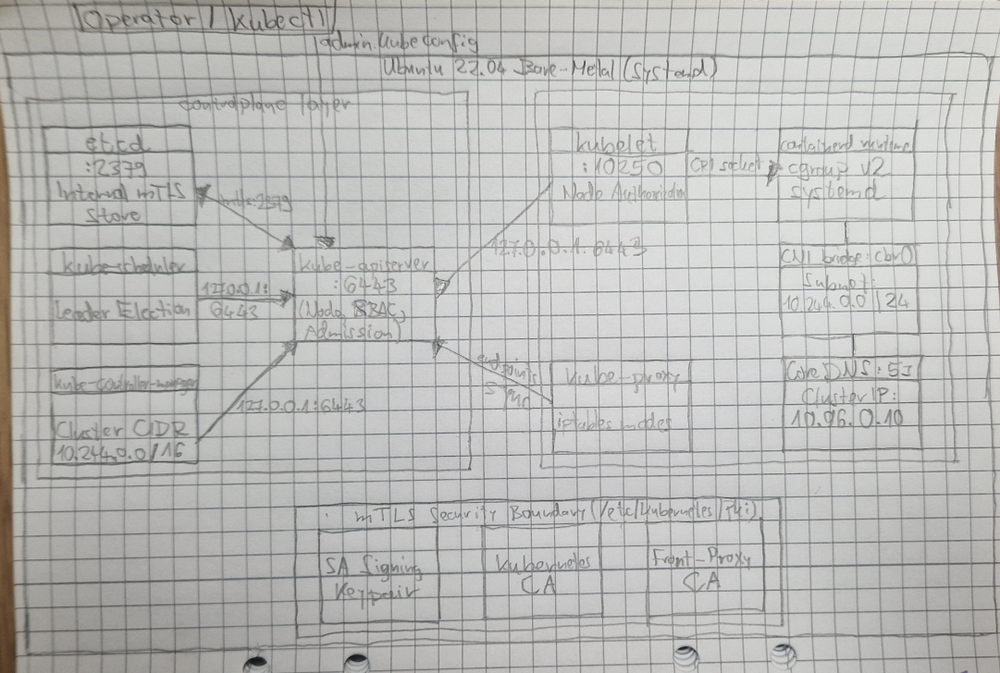

# V4 Vanilla Kubernetes on Bare-Metal

Modular, automated scripts for bootstrapping a Vanilla Kubernetes v1.36.5 cluster directly on Ubuntu 22.04 bare-metal/VM using native systemd units.

## 🚧 Project Status & Scope

This repository represents an active engineering lab and reference architecture for Vanilla Kubernetes on bare-metal.

* **Status:** Tested and verified on clean Ubuntu 22.04 LTS installations (local bare-metal & Multipass KVM).
* **Target Architectures:** `amd64` (x86_64) and `arm64` (aarch64) with automated host detection.
* **Intended Use:** Educational baseline, cloud-native portfolio showcase, and low-dependency on-prem prototyping.

### Compatibility Matrix

| OS Distribution | Environment | Status |
| :--- | :--- | :--- |
| **Ubuntu 22.04 LTS** (Jammy) | Local machine / AWS EC2 | Install and smoke tests passed |
| **Ubuntu 24.04 LTS** (Noble) | Local machine / AWS EC2 | Install and smoke tests passed |
| **Ubuntu 26.04 LTS** (Resolute) | Local machine / AWS EC2 | Install and smoke tests passed |

## Quickstart

```bash
git clone https://github.com/szelese/v4-vanilla-k8s.git
cd v4-vanilla-k8s
sudo ./install.sh
```

## Architectural Scope & Trade-offs

* **Single-Node Topology:** Designed specifically as a single-host control-plane + worker runtime lab using local bridge CNI (10.244.0.0/24). The kube-apiserver binds to 0.0.0.0:6443 for cluster and Pod reachability, while local CLI tooling connects via 127.0.0.1:6443.
* **Multi-Node Expansion Requirements:** Expanding beyond a single node requires more than replacing host-local IPAM with an overlay CNI (e.g. Cilium/Calico): it also requires a dedicated control-plane load balancer / VIP, expanded certificate SANs, and controller-managed PodCIDR allocation.
* **Hardened Static mTLS:** Dedicated x509 PKI issuing mutual TLS certificates for etcd, control plane components, and Kubelet server-client authentication with node SANs. Certificates use 3650-day lifespans without dynamic CSR rotation for operational determinism.

## Architecture



## Execution Pipeline

The cluster is bootstrapped sequentially through modular scripts:

1. **`scripts/01-host-prep.sh`**: Swap off, kernel modules (`overlay`, `br_netfilter`), containerd cgroup v2, and `crictl.yaml`.
2. **`scripts/02-binaries.sh`**: Fetches official k8s v1.36.5, etcd, CNI plugins, and crictl binaries.
3. **`scripts/03-pki.sh`**: OpenSSL mTLS generation (CA, Front-Proxy CA, etcd/apiserver SANs, embedded kubeconfigs).
4. **`scripts/04-control-plane.sh`**: Systemd units for etcd, apiserver, controller-manager, scheduler, and apiserver-to-kubelet RBAC.
5. **`scripts/05-worker-networking.sh`**: Bridge CNI (`10.244.0.0/24`), kubelet, and kube-proxy (iptables mode).
6. **`scripts/06-addons-rbac.sh`**: In-cluster CoreDNS deployment.
7. **`scripts/07-smoke-test.sh`**: Automated validation (pod scheduling, logs/exec mTLS, DNS resolution, and Service routing).


## ✍️ Author & Legal
Ervin Wallin © 2026.
This project is a Kubernetes runtime extension of my cloud-native architecture portfolio. This repository is provided for educational and portfolio purposes.
